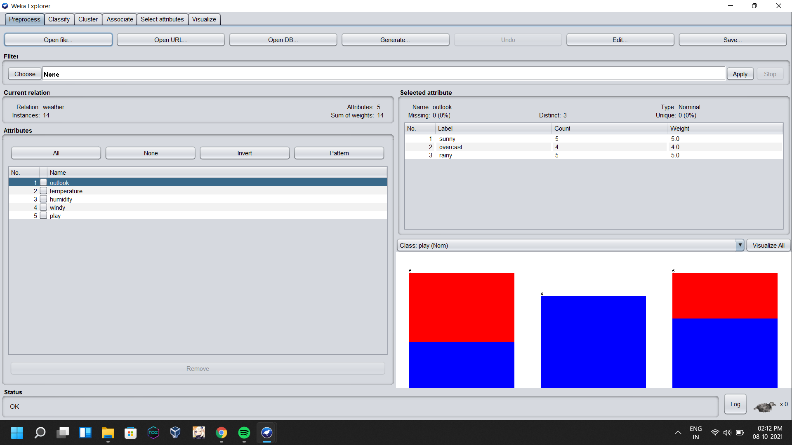
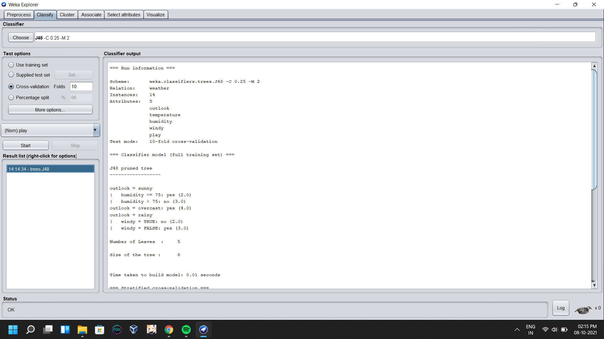
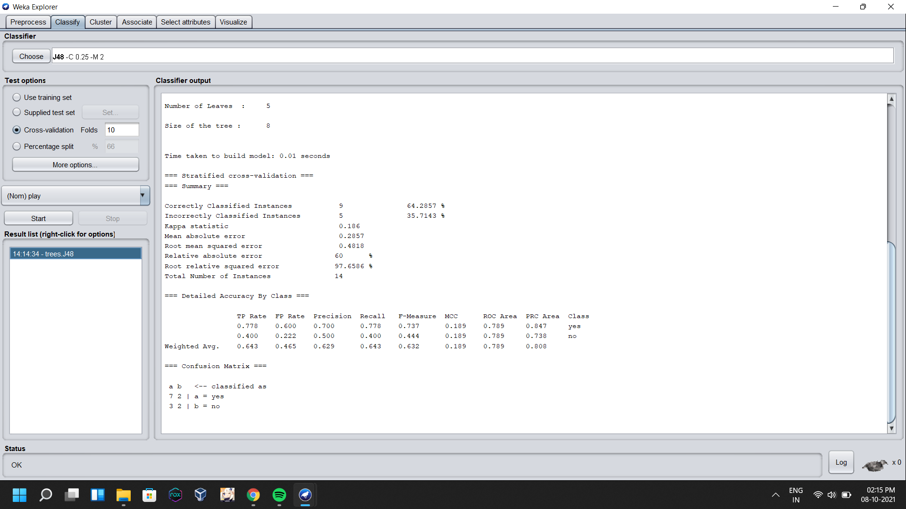
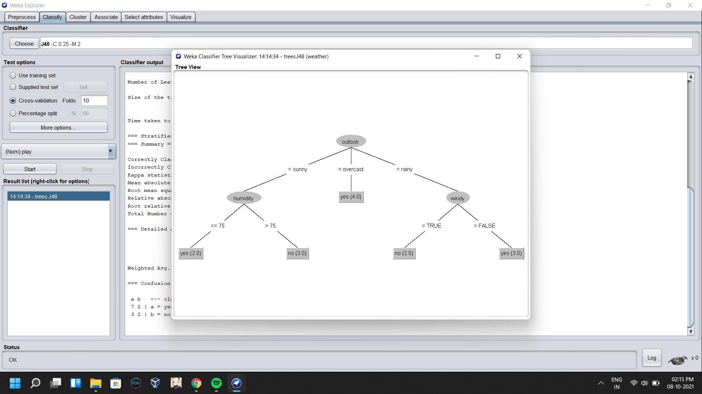

# Exp-4: Demonstrate how to build decision trees using weka tool.

## ==>>Import and Load the dataset from the file.

  

## ==>>Now choose the decision tree to analyze the dataset.

  

  

## ==>>Plot the Decision Tree.

  

